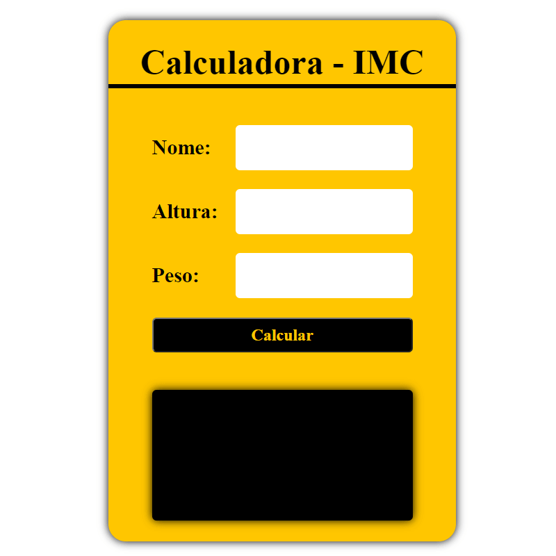
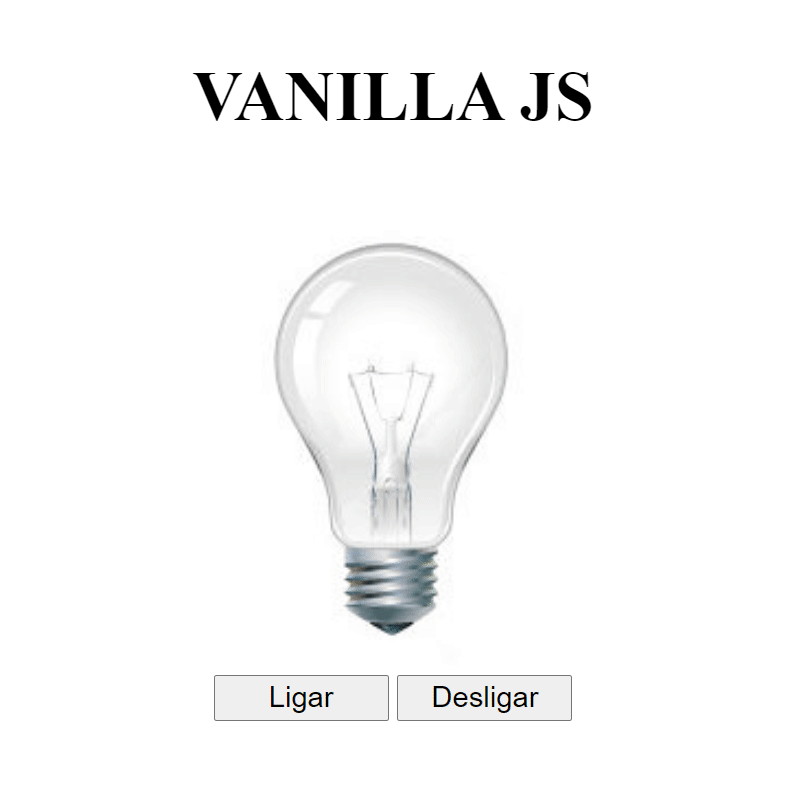
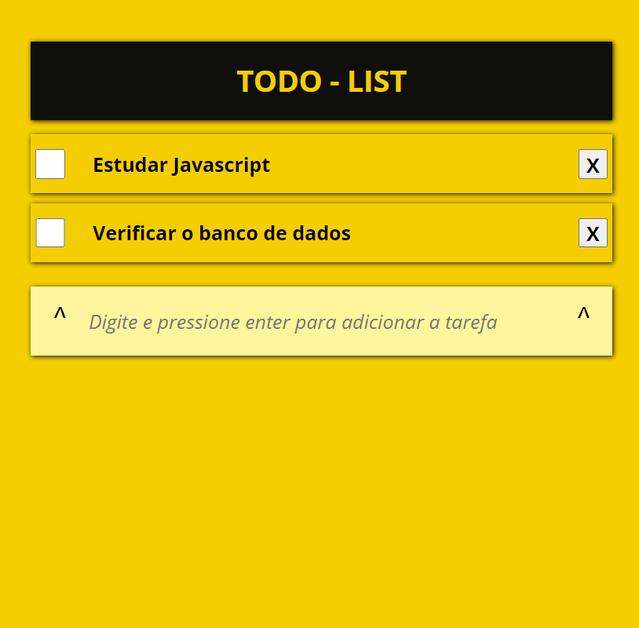

# Mini Projetos com javascript puro

## Objetivo

Desafios JavaScript

## 00 - Calculadora IMC

* <a href="calcula-imc">Verifique o código</a>

## 01 - Lâmpada

* <a href="lampada">Verifique o código</a>

## 02 - Semáforo

* <a href="semáforo">Verifique o código</a>

## 03 - Slide Show

* <a href="slideShow">Verifique o código</a>

## 04 - Drum-kit

* <a href="drum-kit">Verifique o código</a>

## 05 - CountDown

* <a href="countdown">Verifique o código</a>

## 06 - Calculadora

* <a href="calculadora">Verifique o código</a>

## 07 - To-do-list

* <a href="todo-List">Verifique o código</a>
