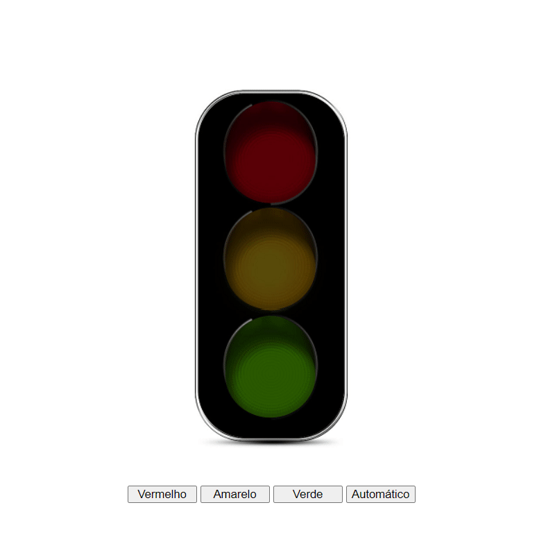
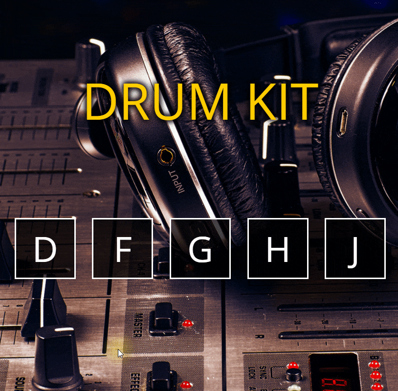

# Mini Projetos com javascript puro

## Objetivo

Desafios JavaScript

## 00 - Calculadora IMC

* <a href="./00-imc/">Verifique o código</a>

## 01 - Lâmpada

* <a href="./01-lamp/">Verifique o código</a>

## 02 - Semáforo

* <a href="./02-semaforo/">Verifique o código</a>

## 03 - Slide Show

* <a href="./03-slideshow/">Verifique o código</a>

## 04 - Drum-kit

* <a href="./04-DRUM-KIT/">Verifique o código</a>

## 05 - CountDown

* <a href="./05-countdown/">Verifique o código</a>

## 06 - Calculadora

* <a href="./06-Calculadora/">Verifique o código</a>

## 07 - To-do-list

* <a href="./07-todo-List/">Verifique o código</a>
